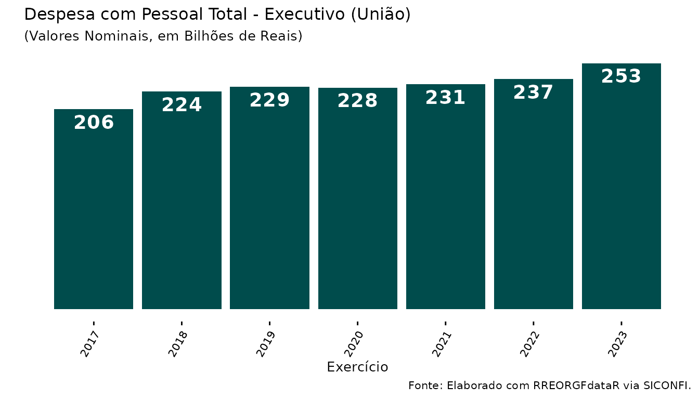
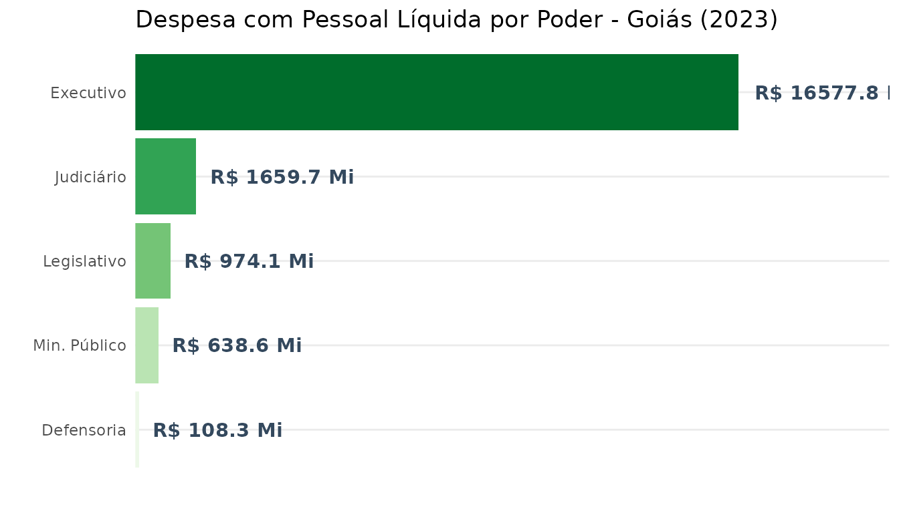

# RGF: Relatório de Gestão Fiscal

## Introdução

Esta vinheta descreve o uso da função
[`RGFdata()`](https://natanaelsl.github.io/RREORGFdataR/reference/RGFdata.md).
Seu objetivo é abstrair a complexidade da API do SICONFI, tornando a
análise dos dados do Relatório de Gestão Fiscal (RGF) muito mais
simples, rápida e escalável.

O Tesouro Nacional disponibiliza a Application Programming Interface
(API) de dados abertos para atender à demanda por dados brutos oriundos
do Siconfi. Por meio dessa ferramenta, é possível obter desde pequenas
frações até grandes volumes de dados inseridos pelos entes subnacionais
e pela União.

No entanto, a estrutura bruta retornada pela API muitas vezes exige um
tratamento complexo. A função
[`RGFdata()`](https://natanaelsl.github.io/RREORGFdataR/reference/RGFdata.md)
automatiza esse processo, resolvendo desde a paginação até a conversão
matemática de colunas temporais relativas (como `<MR-X>`), além de
suportar a extração em lote (vetorizada) de múltiplos exercícios e entes
simultaneamente.

Para iniciar nossas análises, carregamos os pacotes necessários:

``` r

library(RREORGFdataR)
library(dplyr)
library(ggplot2)
```

## Exemplo 1: Análise Longitudinal (Série Histórica)

Neste primeiro exemplo, demonstramos o quão simples é utilizar o pacote
para obter uma série histórica do RGF e empregá-la na elaboração de um
gráfico.

Extrairemos do Anexo 01 (3º quadrimestre) os valores da Despesa com
Pessoal Total (DTP) para o Poder Executivo da União, englobando os anos
de 2017 a 2023 de uma só vez utilizando a vetorização do parâmetro
`year`.

``` r

# Extração da série histórica com um único comando vetorizado
df_rgf_uniao <- RGFdata(
  cod.ibge = 1,
  year = 2017:2023,
  power = "E",
  period = 3,
  annex = 1
) 

# Filtragem dos dados e execução do gráfico
df_rgf_uniao %>%
  filter(
    rotulo == "União",
    cod_conta == "DespesaComPessoalTotal",
    coluna == "VALOR"
  ) %>%
  ggplot(aes(x = exercicio)) +
  geom_col(aes(y = valor), fill = "#004c4c") +
  geom_text(
    aes(y = valor, label = round(valor/1e9, 0)),
    fontface = "bold",
    vjust = 1.4,
    size = 5,
    colour = "white"
  ) +
  labs(
    x = "Exercício", y = "",
    title = 'Despesa com Pessoal Total - Executivo (União)',
    subtitle = '(Valores Nominais, em Bilhões de Reais)',
    caption = "Fonte: Elaborado com RREORGFdataR via SICONFI."
  ) +
  scale_x_continuous(n.breaks = 7) +
  theme_classic() +
  theme(
    legend.position = "none",
    text = element_text(size = 10),
    axis.line = element_blank(),
    legend.title = element_text(size = 12, face = "bold"),
    legend.text = element_text(size = 10),
    axis.text.y = element_blank(),
    axis.text.x = element_text(angle = 60, vjust = .95, hjust = 1, size = 8),
    axis.ticks.y = element_blank(),
    legend.background = element_blank(),
    plot.caption.position = "panel"
  )
```



## Exemplo 2: Análise Transversal (Comparação entre Poderes)

Diferente do RREO, o RGF é segregado por Poder governamental. A
arquitetura da função
[`RGFdata()`](https://natanaelsl.github.io/RREORGFdataR/reference/RGFdata.md)
permite passar múltiplos poderes em um único vetor, consolidando a
análise de um ente federativo inteiro sem a necessidade de múltiplos
downloads manuais estruturados.

Abaixo, extraímos a DTP de todos os poderes do Estado de Goiás para o
encerramento do exercício de 2023.

``` r

# Solicitando dados para Executivo, Legislativo, Judiciário, Ministério Público e Defensoria
df_poderes_go <- RGFdata(
  cod.ibge = 52,
  year = 2023,
  power = c("E", "L", "J", "M", "D"),
  period = 3,
  annex = 1
)

# Comparando as Despesas com Pessoal Líquida (DPL) entre os poderes públicos
df_poderes_go %>%
  filter(
    cod_conta == "DespesaComPessoalLiquida",
    coluna == "TOTAL (ÚLTIMOS 12 MESES) (a)"
  ) %>%
  mutate(
    co_poder = case_when(
      co_poder == "E" ~ "Executivo",
      co_poder == "L" ~ "Legislativo",
      co_poder == "J" ~ "Judiciário",
      co_poder == "M" ~ "Min. Público",
      co_poder == "D" ~ "Defensoria"
    )
  ) %>%
  # PASSO CRÍTICO: Consolida as linhas divididas do mesmo poder (ex: Assembleia + TCE)
  group_by(co_poder) %>%
  summarise(valor = sum(valor, na.rm = TRUE), .groups = "drop") %>%
  # Ordena do menor para o maior APÓS a soma
  mutate(co_poder = reorder(co_poder, valor)) %>%
  ggplot(aes(x = co_poder, y = valor, fill = co_poder)) +
  geom_col(show.legend = FALSE) +
  geom_text(
    aes(label = paste0("R$ ", round(valor/1e6, 1), " Mi")),
    hjust = -0.1, fontface = "bold", color = "#34495e"
  ) +
  coord_flip() +
  scale_fill_brewer(palette = "Greens") + # Ajustado para paleta nativa válida
  labs(
    title = "Despesa com Pessoal Líquida por Poder - Goiás (2023)",
    x = "", y = ""
  ) +
  scale_y_continuous(expand = expansion(mult = c(0, 0.25))) +
  theme_minimal() +
  theme(
    axis.text.x = element_blank(),
    panel.grid.major.x = element_blank(),
    panel.grid.minor.x = element_blank()
  )
```



## Exemplo 3: Ingestão de Data Lake (Persistência em Parquet)

Ao trabalhar com cenários de grande escala (como baixar dados de
municípios em lote nacional), a função disponibiliza integração nativa
com o pacote `arrow`. Utilizando o argumento `save_path` com a extensão
`.parquet`, a função persiste os dados de forma colunar compactada.

``` r

# Extração massiva para todos os municípios, salvando diretamente em disco
RGFdata(
  cod.ibge = "all_muni",
  year = 2023,
  power = "E",
  period = 2,
  annex = 1,
  simplified = TRUE, # Suporte nativo ao RGF Simplificado Municipal (< 50k hab.)
  save_path = "dados_rgf_municipios_2023.parquet"
)

# Leitura otimizada (Lazy Loading) do arquivo gerado via Apache Arrow
library(arrow)
dataset_rgf <- open_dataset("dados_rgf_municipios_2023.parquet")

# O motor C++ filtra direto do HD, sem carregar o país inteiro na RAM
dados_goiania <- dataset_rgf %>%
  filter(cod_ibge == "5208707") %>% 
  collect()
```
